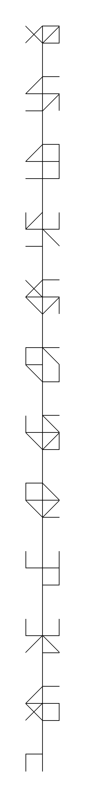
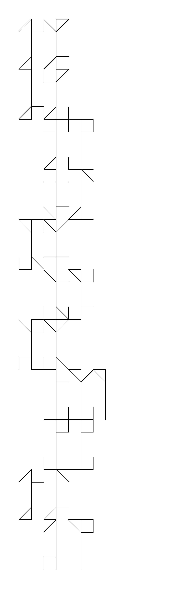

# Cistercian manipulator

## Description

This program was created to help solve the second enigma of "Le Tresor de Gisor" treasure hunt.

Cistercian numbers are a numeral system that was used by the Cistercian monks in the Middle Ages. It use a set of lines to represent numbers from 1 to 9999.


The enigma has Roman numerals and a Cistercian number. We assumed that we needed to convert the Romans numerals to Arabic numerals and then to Cistercian numbers and assemble the glyphs to form some word or number.

It turned out to be a very wrong assumption which was invalidated by the author of the treasure hunt.

You can use it for other enigma that may use this mechanism.

## Requirements

[Docker](https://www.docker.com/)

## Installation

```bash
make install
```

## Usage

You can customize the .env.local file to alter the design of the glyphs.

### Generate all Cistercian numbers from 1 to 9999

```bash
make generate
```

### Playground

```bash
make merge
```

Alternatively if you have [imv](https://github.com/eXeC64/imv) installed you can run the following command to generate the numbers then view them in a gallery;

```bash
make merge-view
```

### Local CI

```bash
make cc
```

## Example output

Difference


Difference truncated


Side by Side unmerged


Side by Side unmerged truncated


Side by Side merged


Side by Side merged truncated


Multi line merged



Multi line unmerged


Multi line shift unmerged full space



Multi line shift unmerged half space


Multi line shift merged full space


Multi line shift merged half space

